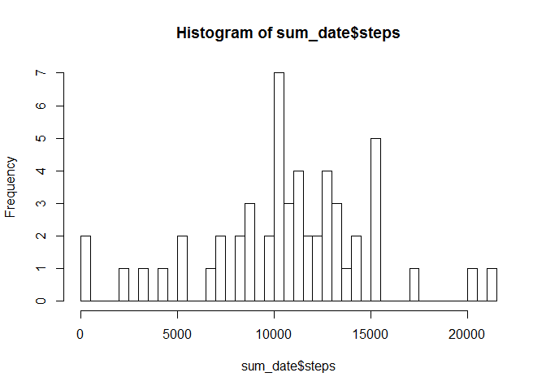
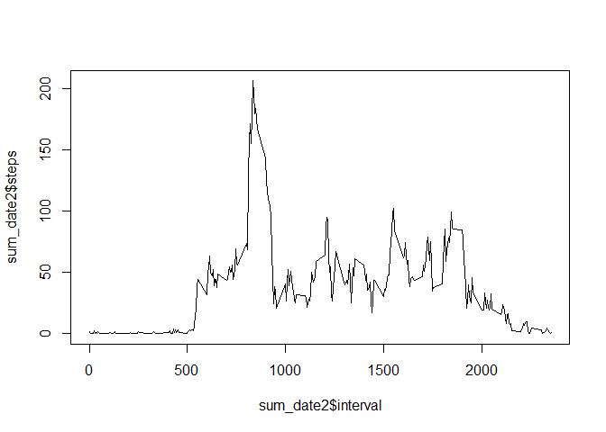
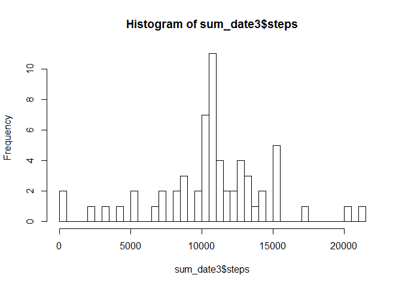
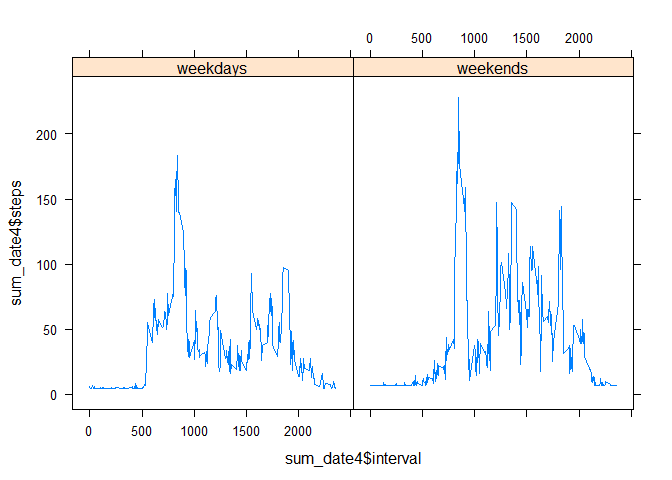

# Peer Assignment 1

###What is mean total number of steps taken per day###


```r
library(dplyr)
```

```
## 
## Attaching package: 'dplyr'
## 
## The following object is masked from 'package:stats':
## 
##     filter
## 
## The following objects are masked from 'package:base':
## 
##     intersect, setdiff, setequal, union
```

```r
library(ggplot2)
```

```
## Warning: package 'ggplot2' was built under R version 3.2.1
```

```r
dat<-read.csv("activity.csv")
dat1<-dat[complete.cases(dat),]
sum_date<-aggregate(steps~date,dat1,sum)
sum_date$date<-as.Date(sum_date$date)
hist(sum_date$steps,breaks=50)
```

 

```r
mean(sum_date$steps)
```

```
## [1] 10766.19
```

```r
median(sum_date$steps)
```

```
## [1] 10765
```

###What is the average daily activity pattern?###


```r
sum_date2<-aggregate(steps~interval,dat1,mean)
plot(sum_date2$interval,sum_date2$steps,type = "l")
```

 

```r
sum_date2[sum_date2$steps==max(sum_date2$steps),]
```

```
##     interval    steps
## 104      835 206.1698
```

###Imputing missing values###
The na's value in the data frame has been replaced by the mean steps in the data frame excluding na values


```r
sum(!complete.cases(dat))
```

```
## [1] 2304
```

```r
dat_new<-dat
dat_new$steps[is.na(dat_new$steps)]<-as.integer(mean(dat1$steps))
sum_date3<-aggregate(steps~date,dat_new,sum)
sum_date3$date<-as.Date(sum_date3$date)
hist(sum_date3$steps,breaks=50)
```

 

```r
mean(sum_date3$steps)
```

```
## [1] 10751.74
```

```r
median(sum_date3$steps)
```

```
## [1] 10656
```


###Are there differences in activity patterns between weekdays and weekends?###


```r
library(lubridate)
```

```
## Warning: package 'lubridate' was built under R version 3.2.1
```

```r
dat_new<-dat
```


```r
dat_new$steps[is.na(dat_new$steps)]<-as.integer(mean(dat1$steps))
dat_new$date<-as.Date(dat_new$date)
dat_new$day<-wday(dat_new$date)
dat_new$day[dat_new$day<=5]<-"weekdays"
dat_new$day[dat_new$day==6|dat_new$day==7]<-"weekends"
library(lattice)
sum_date4<-aggregate(steps~interval+day,dat_new,mean)
xyplot(sum_date4$steps~sum_date4$interval|sum_date4$day,type="l")
```

 


